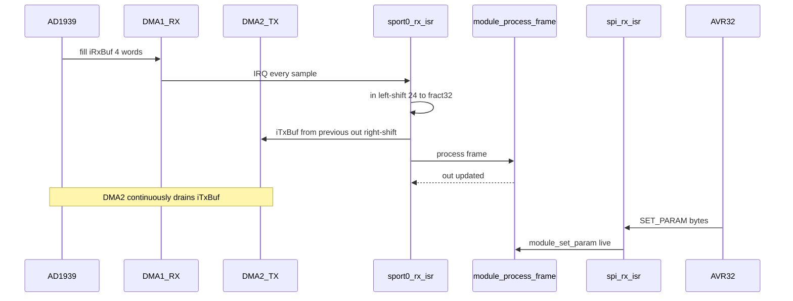
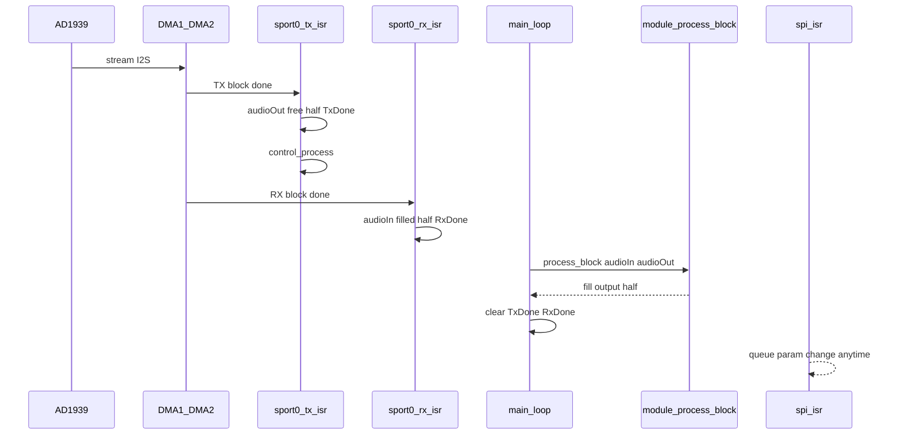
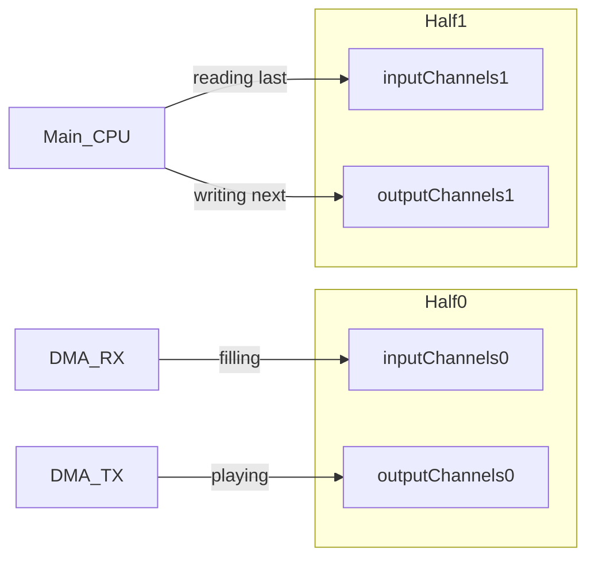

# Frame vs Block Blackfin Audio Control Flow

**Context:** `apps/mix` + [`modules/mix`](../modules/mix) use [`bfin_lib`](../bfin_lib)
(frame). `apps/spray` + [`modules_block/spray`](../modules_block/spray) use
[`bfin_lib_block`](./) (block). Mix sounds clean on device; spray can be heavily
distorted. This document describes both control flows and overrun behavior, and
calls out differences most likely to cause distortion.

Related prior review: [`dsp-block-test/DMA-REVIEW.md`](../dsp-block-test/DMA-REVIEW.md).

---

## Summary comparison

| Concern | Frame (`bfin_lib`) | Block (`bfin_lib_block`) |
|--------|---------------------|-------------------------|
| Process site | Inside SPORT RX ISR | Main loop |
| Hook | `module_process_frame()` | `module_process_block(in, out)` |
| DMA | Autobuffer, single 4-word RX/TX | Descriptor ping-pong, 2D deinterleave |
| Block size | 1 sample (implicit) | `MODULE_BLOCKSIZE` (spray: **16**) |
| Deadline | ~20.8 µs @ 48 kHz | ~333 µs @ 16 / 48 kHz |
| 24↔32 packing | Explicit `<<8` / `>>8` in ISR | Optional via `MODULE_AUDIO_CONVERT_24_32` (inlined in main; spray on) |
| SPORT TX | `TFSR \| TCKFE` | `TFSR \| TCKFE \| LATFS` |
| Params | Applied live in SPI ISR | Queued in SPI ISR, applied in TX ISR |
| CV | SPORT1 + `cv_update()` | Not driven (spray CV is no-op) |
| Overrun handling | None (implicit glitch) | Optional `MODULE_AUDIO_XRUN_DETECT` + always-on `bfin_get_xruns` SPI |

---

## 1. Frame path (`bfin_lib`) — mix

### Boot

[`bfin_lib/src/main.c`](../bfin_lib/src/main.c) initializes clocks, SPORT0/1, DMA,
SPI slave, `module_init()`, interrupts, enables DMA/SPORT, then the codec. The
idle loop does nothing: *"everything happens in ISRs."*

`processAudio` stays 0 until AVR32 sends `MSG_ENABLE_AUDIO` over SPI.

### Hardware / DMA

- SPORT0: I2S, 24-bit, external clocks — [`bfin_lib/src/init.c`](../bfin_lib/src/init.c)
  `init_sport0()`
- DMA1 → RX into `iRxBuf[4]` (IRQ on complete, autobuffer)
- DMA2 ← TX from `iTxBuf[4]` (no IRQ, autobuffer)
- DMA4 / SPORT1 → CV DAC (`cvTxBuf`)

TX configuration (**no `LATFS`**):

```c
// bfin_lib/src/init.c
*pSPORT0_TCR1 = TFSR | TCKFE;
*pSPORT0_TCR2 = SLEN_24 | TXSE | TSFSE;
```

### Audio ISR (entire DSP pipeline)

```c
// bfin_lib/src/isr.c — sport0_rx_isr()
READY_LO;
if (!processAudio) { /* clear IRQ and return */ }
in[0] = (iRxBuf[INTERNAL_ADC_L0] << 8) & 0xffffff00;
// ... in[1..3]
iTxBuf[INTERNAL_DAC_L0] = out[0] >> 8;
// ... iTxBuf[1..3] from previous out[]
module_process_frame();
READY_HI;
/* clear DMA1 IRQ */
```

**Pipeline:** TX is one frame late (write last `out[]`, then compute new `out[]`
from current `in[]`).

Mix DSP ([`modules/mix/mix.c`](../modules/mix/mix.c)) multiplies `in[]` by slewed
gains and writes `out[]`; may call `cv_update()`.

### Control / params

- SPI ISR → `spi_process` → **`module_set_param` directly** (no FIFO;
  `control.c` FIFO is `#if 0`)
- Host waits on READY while audio/SPI ISRs are busy

### Timers

No software timer paces audio. Rate = AD1939 SPORT clocks (~48 kHz).

### Frame control-flow diagram



### If `module_process_frame` does not finish in time

**Deadline:** one sample period (~20.8 µs).

There is **no xrun flag/counter**. Behavior:

1. DMA autobuffer keeps running over the same `iRxBuf` / `iTxBuf`.
2. While still inside the ISR, RX overwrites `iRxBuf`; TX **replays** last
   `iTxBuf` (held sample).
3. The next DMA IRQ does not nest into IVG9; it waits until this ISR returns →
   intermediate frames are **dropped**, not queued.
4. READY stays low for the whole overrun → host param traffic stalls.

Result: clicks / repeated samples / missing input frames — not a clean mute.

---

## 2. Block path (`bfin_lib_block`) — spray

### Boot

[`bfin_lib_block/src/main.c`](src/main.c): clock, EBIU, SPI slave, SPORT0,
interrupts, DMA descriptors, `module_init()`, enable DMA/SPORT, codec reset,
then READY high.

`processAudio` still gated by SPI `MSG_ENABLE_AUDIO`.

### Timebase / DMA sizing

From [`audio.h`](src/audio.h) and spray
[`module_custom.h`](../modules_block/spray/module_custom.h):

- 48 kHz, 4 channels, `MODULE_BLOCKSIZE = 16`
- Block period ≈ **333 µs**

2D large-descriptor DMA deinterleaves into `[wire][frame]` ([`dma.c`](src/dma.c))
in SPORT arrival order **L0, L1, R0, R1** (indices 0–3). Mix/app logical order is
**L0, R0, L1, R1** (same remap as frame `INTERNAL_ADC_*` / `INTERNAL_DAC_*`).
Modules should index via [`audio_channels.h`](src/audio_channels.h)
(`IN_x_IDX` / `OUT_x_IDX`, `audio_in_channel` / `audio_out_channel`) rather than
assuming wire index equals logical channel.

```c
#define X_COUNT AUDIO_CHANNELS
#define X_MOD (AUDIO_SAMPLESIZE * MODULE_BLOCKSIZE)
#define Y_COUNT MODULE_BLOCKSIZE
#define Y_MOD (((1 - AUDIO_CHANNELS) * MODULE_BLOCKSIZE + 1) * AUDIO_SAMPLESIZE)
#define DMA_CONFIG ( DMA_FLOW_DESC | WDSIZE_32 | DI_EN | DMA2D )
```

Ping-pong halves: `inputChannels0/1`, `outputChannels0/1`.

### ISRs (buffer handoff only; no DSP)

[`isr.c`](src/isr.c):

| IRQ | Priority | Handler | Work |
|-----|----------|---------|------|
| DMA2 TX complete | IVG9 | `sport0_tx_isr` | Flip `audioOut`, `audioTxDone=1`, **`control_process()`**, clear IRQ |
| DMA1 RX complete | IVG10 | `sport0_rx_isr` | Flip `audioIn`, `audioRxDone=1`, clear IRQ |
| SPI | IVG11 | `spi_isr` | Byte protocol → queue params |

**No 24↔32 conversion in the audio ISRs** — unlike frame path. When
`MODULE_AUDIO_CONVERT_24_32` is enabled (see module `module_custom.h`),
[`audio_convert.h`](src/audio_convert.h) inlines RX `<< 8` / TX `>> 8` around
`module_process_block` in main.

### Main processing loop

```c
// bfin_lib_block/src/main.c
while (1) {
  if (audioTxDone && audioRxDone && processAudio) {
    module_process_block(audioIn, audioOut);
    audioTxDone = 0;
    audioRxDone = 0;
  }
}
```

Spray DSP ([`modules_block/spray/spray_module.c`](../modules_block/spray/spray_module.c)):
for each of 16 frames, advance amp slews, mix four inputs to all four outputs.
Interrupts stay **enabled** during this (CLI was abandoned — comments note User
mode cannot use CLI).

### SPORT TX difference (distortion suspect #1)

```c
// bfin_lib_block/src/serial.c
*pSPORT0_TCR1 = TFSR | TCKFE | LATFS;
*pSPORT0_TCR2 = SLEN_24 | TXSE | TSFSE;
```

Frame lib has **no** `LATFS`. RX still has no late FS. Early RX + late TX is
called out as high-risk in [`DMA-REVIEW.md`](../dsp-block-test/DMA-REVIEW.md) §1.

### Sample format difference (distortion suspect #2)

Frame ISR forces Q1.31-ish layout with `<< 8` / `>> 8`. Block path historically
fed raw SPORT words into `mult_fr1x32x32`. Modules that need fract32 packing
set `#define MODULE_AUDIO_CONVERT_24_32 1` in `module_custom.h` (spray does);
[`main.c`](src/main.c) then calls inlined `audio_convert_rx_24_to_32` /
`audio_convert_tx_32_to_24` around `module_process_block`. Default is off
(`audio.h` defines it to 0 if omitted). Pass-through of identical bit patterns
can still sound “OK” without convert; **math modules need the shift**.

### Control / params

1. SPI ISR last SET_PARAM byte → update `paramData` + `control_add()`
   ([`spi.c`](src/spi.c), [`control.c`](src/control.c))
2. TX ISR drains FIFO → `module_set_param` once per TX block
3. Overflow → LED3 low; depth 64

`READY` around block DSP is **commented out** (to avoid AVR32 event-queue
stalls).

### Block control-flow diagram



### Ping-pong ownership



Exactly one half of spare buffer time (= one block period) for DSP.

### If `module_process_block` does not finish in time

**Deadline:** one block period after both done flags are set (~333 µs for spray).

When `MODULE_AUDIO_XRUN_DETECT` is enabled (spray sets it to `1`; default `0`),
two classes of xrun are counted (per direction):

| Counter | Class | Meaning |
|---------|-------|---------|
| `xrunWindowRx` / `xrunWindowTx` | Window overrun | RX/TX ISR found the done flag already set |
| `xrunClashRx` / `xrunClashTx` | Buffer clash | ISR about to hand DMA the half main still holds |

Main publishes `audioProcBusy` + `audioProcIn`/`audioProcOut` around convert/process.
Clash checks use the **next DMA fill target**, not the newly completed half.

SPI readout is always available (`MSG_GET_XRUN_COM` / `bfin_get_xruns`): live counters
when detect is on, all zeros when off. Spray polls ~2 Hz and `print_dbg`s on change.

Without detection (or ignoring the counters), consequences of a late process:

1. **DMA keeps cycling.** ISRs flip pointers and set done flags again while main
   still uses the **stale pointer values** from call entry.
2. Those buffers are again DMA-owned → **TX underrun** (CPU writes while DMA
   transmits) and/or **RX overwrite** (CPU reads while DMA fills) → clicks, torn
   samples, repeats.
3. After a late process, main always does `audioTxDone = audioRxDone = 0`. If
   ISRs already marked the *next* block ready during the overrun, that wake is
   **erased** → main idles an extra block while DMA keeps playing whatever is in
   the ping-pong halves (stale/torn). Overruns can cascade.
4. `control_process()` still runs every TX ISR (params still update on block
   boundaries).
5. Non-volatile `audioIn`/`audioOut` historically could reuse stale pointers under
   `-O3`; they are now `volatile` in [`audio.h`](src/audio.h).

---

## 3. Distortion debugging lens (spray vs mix)

Spray’s DSP algorithm matches mix’s mix math; the lib plumbing differs. Most
plausible root causes for **heavy** distortion (before assuming “CPU too slow”):

1. **Missing 24↔32 shift** on block I/O while using `mult_fr1x32x32` — frame does
   this in the ISR; block modules opt in via `MODULE_AUDIO_CONVERT_24_32`
   (spray enabled).
2. **`LATFS` on TX only** — framing mismatch vs working mix path.
3. Less likely for constant heavy distortion (more for intermittent glitches):
   process overrun, non-volatile buffer pointers, param races.

Overrun would more typically produce crackle / dropouts than continuous heavy
distortion when CPU load is modest (16 samples of mix is light).

---

## 4. Key code index

### Frame

| File | Role |
|------|------|
| [`bfin_lib/src/main.c`](../bfin_lib/src/main.c) | Idle; ISR-driven |
| [`bfin_lib/src/isr.c`](../bfin_lib/src/isr.c) | RX ISR = process + packing |
| [`bfin_lib/src/init.c`](../bfin_lib/src/init.c) | SPORT/DMA setup |
| [`modules/mix/mix.c`](../modules/mix/mix.c) | `module_process_frame` |

### Block

| File | Role |
|------|------|
| [`bfin_lib_block/src/main.c`](src/main.c) | Wait flags → `module_process_block` |
| [`bfin_lib_block/src/isr.c`](src/isr.c) | TX/RX/SPI ISRs |
| [`bfin_lib_block/src/dma.c`](src/dma.c) | Descriptor ping-pong |
| [`bfin_lib_block/src/serial.c`](src/serial.c) | SPORT incl. `LATFS` |
| [`bfin_lib_block/src/control.c`](src/control.c) | Param FIFO |
| [`modules_block/spray/spray_module.c`](../modules_block/spray/spray_module.c) | `module_process_block` |
| [`dsp-block-test/DMA-REVIEW.md`](../dsp-block-test/DMA-REVIEW.md) | Known block-path risks |
