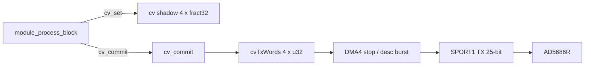

# CV DAC integration for `bfin_lib_block`

proposal for driving the aleph panel **AD5686R** quad CV DAC from block-rate
DSP modules. the frame library (`bfin_lib`) already talks to this part; the
block library configures pins / SPORT1 scaffolding but does **not** enable
DMA or expose an API.

related:

- frame driver: [`bfin_lib/src/cv.c`](../bfin_lib/src/cv.c),
  [`bfin_lib/src/init.c`](../bfin_lib/src/init.c) (`init_sport1`, DMA4)
- frame module pattern (staggered): [`modules/mix/mix.c`](../modules/mix/mix.c)
  `process_cv()`
- block audio control flow: [`AUDIO-CONTROL-FLOW.md`](./AUDIO-CONTROL-FLOW.md)
- block SPORT1 stub: [`src/serial.c`](./src/serial.c) `init_sport1()`

---

## goals

1. expose a small CV API to block modules (`modules_block/*`).
2. update all four channels **once per audio block** by default (simultaneous
   logical commit).
3. use **DMA + SPORT1** (same hardware path as the frame lib), not bit-banged
   SPI on the CPU.
4. keep CV traffic off the audio ISR path; kick transfers from the main loop /
   module process so DSP CPU cost stays near zero.
5. allow modules that need a higher CV rate to flush **more than once per
   block** without reintroducing the frame-lib single-word race.

out of scope for v1: daisy-chain SDO. LDAC deferred update is a proposed
future addition (see below); v1 keeps write-and-update cmd `0x3`.

---

## hardware background

| item | detail |
|------|--------|
| part | AD5686R, 16-bit × 4, SPI-compatible |
| blackfin port | SPORT1 TX secondary (`DTSEC`) |
| DMA | DMA4 → SPORT1 TX |
| word | 24-bit AD5686 frame + 1 pad bit → **25** SPORT clocks (FS timing kludge) |
| clock | internal SPORT clock, `TCLKDIV = 1` → ~27 MHz (`sclk / (2×(div+1))` at 108 MHz) |
| command used | `0x3` write-and-update (per-channel immediate) |
| `LDAC` GPIO | direction set; **not toggled** today (deferred latch unused) |

`cv_update` packing (frame lib, keep compatible):

```c
/* cmd 0x3, addr bit (1<<ch), data = fract32 >> 15, then << 1 for 25-bit FS */
buf  = (0x3 << 20) | ((1 << ch) << 16) | ((val >> 15) & 0xffff);
cvTxBuf = buf << 1;
```

input domain: `fract32` in `[0, 0x7fffffff]` → DAC code `[0, 0xffff]`.

---

## block-path architecture

block audio already runs in the **main loop** with ~**333 µs** per block at
`MODULE_BLOCKSIZE = 16` / 48 kHz. that is enough time for four (or more) DAC
frames with DMA, without touching the audio ISR.

```text
boot
  init_cv()
  init_sport1()
  init_dma_cv()          /* DMA4 → 4-word (or N-word) TX buffer */
  enable_dma_sport1()

main loop (existing)
  wait audioTxDone && audioRxDone
  convert / module_process_block / meters / convert
  /* optional library auto-commit — see below */
  clear done flags

module_process_block (typical)
  … audio DSP …
  cv_set(0..3, values)   /* shadow only */
  cv_commit()            /* pack + kick DMA once */
```



### DMA model (v1)

prefer a **4-word buffer** with a **one-shot / stop-mode** (or short
descriptor) transfer started by `cv_commit()`:

- pack all four channel words into `cvTxWords[4]`.
- start DMA4 with `X_COUNT = 4` (or four descriptor hops).
- do **not** continuous-autobuffer a single word (that is the frame race).
- if a previous commit is still busy, either wait briefly (~10 µs worst case)
  or drop/coalesce (module policy; default: wait).

CPU cost of commit ≈ pack four words + write DMA registers. SPI shifts in
parallel with later DSP / idle time if the module does not poll.

### timing budget

| quantity | approx |
|----------|--------|
| block period @ 16 / 48 kHz | 333 µs |
| one DAC SPI frame + SYNC gap | ~2–3 µs |
| four channels once | ~8–12 µs digital |
| AD5686 analog settle | 5–8 µs (no CPU) |
| DSP impact if fire-and-forget DMA | negligible |

four channels once per block uses roughly **3%** of the block even if the
CPU busy-waits; with DMA it should be far less.

---

## library wiring (`bfin_lib_block`)

new files (names suggestive):

| file | role |
|------|------|
| `src/cv.h` / `src/cv.c` | public API + pack + shadow + commit |
| DMA helpers | extend `dma.c` / `dma.h` or keep CV DMA setup in `cv.c` |

boot changes in [`src/main.c`](./src/main.c) (order like frame `main`):

1. `init_flags()` (already sets CV reset / LDAC direction)
2. `init_cv()` — pulse `CV_DAC_RESET`
3. `init_sport1()` — already in `serial.c`
4. `init_dma_cv()` + `enable_dma_sport1()`
5. existing sport0 audio DMA enable

optional compile flag (module_custom / makefile):

```c
#ifndef MODULE_AUDIO_CV
#define MODULE_AUDIO_CV 1
#endif
```

when `0`, skip CV init and provide stubs so modules without CV still link.

optional **auto-commit** in `main` after `module_process_block` is **not**
required if modules call `cv_commit()` explicitly (preferred: module owns
when CV is pushed).

---

## API exposed to block modules

```c
/* src/cv.h */

#ifndef BFIN_LIB_BLOCK_CV_H
#define BFIN_LIB_BLOCK_CV_H

#include "types.h"

#define CV_CHANNELS 4

/* bring AD5686 out of reset. call once at boot before SPORT1/DMA enable. */
void init_cv(void);

/* SPORT1 + DMA4 setup / enable — may live in cv.c or dma.c. */
void init_dma_cv(void);
void enable_dma_sport1(void);

/*
 * store a channel value in the software shadow.
 * ch in [0, 3]; val in [0, 0x7fffffff].
 * does not touch the DAC until cv_commit().
 */
void cv_set(u8 ch, fract32 val);

/* read back shadow (optional helper for modules). */
fract32 cv_get(u8 ch);

/*
 * pack shadow[0..3] into DMA words and start a 4-channel burst.
 * always loads all four channels. returns 0 if kicked, non-zero if
 * previous transfer still busy and wait/drop policy failed
 * (implementation choice: usually block until ready).
 */
u8 cv_commit(void);

/* 1 if DMA4 CV burst is still in flight. */
u8 cv_busy(void);

/*
 * optional: spin until !cv_busy(), with a short timeout.
 * for modules that must guarantee the previous burst finished before
 * starting another mid-block.
 */
u8 cv_wait(void);

#endif
```

notes:

- **`cv_set` is cheap** and safe from `module_process_block` (and from param
  handlers that only update shadows).
- **`cv_commit` is the only place** that races with DMA; it must not overwrite
  an in-flight buffer. use double-buffering (`cvTxWordsA/B`) if commits can
  overlap preparation of the next burst while DMA drains the previous.
- keep the AD5686 wire format identical to [`bfin_lib/src/cv.c`](../bfin_lib/src/cv.c)
  so hardware behaviour matches frame modules.

---

## pseudo-code: typical once-per-block module

```c
#include "cv.h"
#include "module.h"
/* … filters / params … */

static fract32 cvTarget[CV_CHANNELS];
static filter_1p_lo cvSlew[CV_CHANNELS];

void module_init(void) {
  u8 ch;
  for(ch = 0; ch < CV_CHANNELS; ++ch) {
    filter_1p_lo_init(&(cvSlew[ch]), /* … */);
    cvTarget[ch] = 0;
    cv_set(ch, 0);
  }
  cv_commit(); /* optional initial zero */
}

void module_set_param(u32 idx, ParamValue v) {
  /* map CV level / slew params into cvTarget[] / filter coeffs */
}

void module_process_block(buffer_t *in, buffer_t *out) {
  u16 frame;
  u8 ch;

  /* --- audio --- */
  for(frame = 0; frame < MODULE_BLOCKSIZE; ++frame) {
    /* … read (*in)[ch][frame], write (*out)[ch][frame] … */
  }

  /* --- CV: slew in block domain, then one hardware flush --- */
  for(ch = 0; ch < CV_CHANNELS; ++ch) {
    if(!filter_1p_sync(&(cvSlew[ch]))) {
      fract32 y = filter_1p_lo_next(&(cvSlew[ch]));
      cv_set(ch, y);
    }
  }
  cv_commit();
}
```

slewing tip: advance the 1p filter **once per block** with a block-rate
coefficient (`c_s^N`), or advance `MODULE_BLOCKSIZE` times with the old
sample-rate coeff. prefer a block-native slew for CPU. the frame stagger
hack (one channel per sample) is **not** needed.

minimal “static CV from params” module:

```c
void module_process_block(buffer_t *in, buffer_t *out) {
  /* audio … */

  cv_set(0, paramCv0);
  cv_set(1, paramCv1);
  cv_set(2, paramCv2);
  cv_set(3, paramCv3);
  cv_commit();
}
```

---

## updating the DACs more than once per block

default rate @ blocksize 16 / 48 kHz: **one commit / block ≈ 3 kHz** for all
four channels together. that is enough for most panel CV. when a module
needs a higher update rate (e.g. audio-rate-ish envelopes on CV, or
sample-and-hold at several points in the block):

### option A — multiple `cv_commit()` calls

```c
void module_process_block(buffer_t *in, buffer_t *out) {
  u16 frame;
  for(frame = 0; frame < MODULE_BLOCKSIZE; ++frame) {
    /* audio sample frame … */

    if((frame & 3) == 0) {          /* e.g. every 4 samples → ~12 kHz */
      cv_set(0, env0_at(frame));
      cv_set(1, env1_at(frame));
      cv_set(2, env2_at(frame));
      cv_set(3, env3_at(frame));
      cv_wait();                    /* ensure prior DMA finished */
      cv_commit();
    }
  }
}
```

budget: each commit ≈ 8–12 µs digital. at every-4-samples in a 16-sample
block that is **4 commits ≈ 32–48 µs**, still ≪ 333 µs. always `cv_wait()`
(or double-buffer) between commits so the 4-word DMA buffer is not clobbered.
every `cv_commit()` reloads **all four** channels from the shadow.

### option B — queued multi-burst DMA (advanced)

for sustained high rates without mid-block waits:

1. module pushes full 4-tuples into a small ring (always all channels).
2. DMA descriptor list walks the ring (or a linear “this block’s bursts”
   array prepared up front).
3. one kick at the start (or end) of the block drains K bursts.

this matches the spirit of the mix FIXME (multi-word DMA) without a SPORT1
TX ISR. v1 does not require it; option A is enough.

### upper bound

datasheet-limited continuous rate is on the order of **~80–100 kHz SPI
frames**, so roughly **~20–25 kHz** full 4-channel `cv_commit()` calls. the
audio block window is not the limiter until commits become numerous; **DMA
buffer ownership** is.

---

## interaction with the DSP window

| practice | effect on `module_process_block` |
|----------|----------------------------------|
| `cv_set` only | none (memory write) |
| `cv_commit` fire-and-forget | microseconds of setup; SPI overlaps later work |
| `cv_wait` + `cv_commit` once at end of block | ~0–12 µs after audio; usually fine |
| many mid-block wait+commit pairs | adds up; stay within ~tens of µs total |
| continuous single-word autobuffer like frame lib | **avoid** — reintroduces the race |

do **not** call `cv_commit` from the SPORT0 RX/TX ISRs. keep CV on the main
/ module path so audio DMA IRQs stay short (as they are in block today).

---

## migration notes for modules

| frame (`bfin_lib`) | block (`bfin_lib_block`) |
|--------------------|-------------------------|
| `cv_update(ch, v)` every sample, rotate `cvChan` | `cv_set` + one `cv_commit` per block |
| slew at sample rate, one ch/frame | slew at block rate (or N steps), all ch |
| effective 12 kHz / ch staggered | 3 kHz simultaneous (blocksize 16), or higher via multi-commit |
| DMA4 single-word autobuffer | DMA4 4-word one-shot burst |

---

## implementation checklist

- [ ] add `src/cv.c` / `src/cv.h` (shadow, pack, commit, busy/wait)
- [ ] DMA4 init/enable for 4-word TX buffer; wire into boot `main`
- [ ] call `init_cv`, `init_sport1`, `enable_dma_sport1` from `main`
- [ ] optional `MODULE_AUDIO_CV` gate + stubs
- [ ] double-buffer TX words if mid-block multi-commit is supported in v1
- [ ] document one `modules_block` example (or mx44 CV outs) using the API
- [ ] update [`AUDIO-CONTROL-FLOW.md`](./AUDIO-CONTROL-FLOW.md) CV row from
      “not driven” to this spec once implemented

---

## future: LDAC deferred update

today `/LDAC` is only configured as a GPIO output; it is never pulsed. SPI
command `0x3` writes **and** updates each channel as its frame completes, so
the four analog outs can change at slightly different times within one
`cv_commit()` burst (~8–12 µs apart).

a later addition can use the AD5686 **deferred load** path for an explicit
simultaneous update:

1. hold `/LDAC` high (or leave inactive).
2. `cv_commit()` (or a variant) shifts all four channels with a **write to
   input register only** command (not write-and-update).
3. after DMA completes, the module (or library) pulses `/LDAC` low then high
   via `CV_DAC_LDAC_LO` / `CV_DAC_LDAC_HI` so all DAC registers load together.

sketched API (names suggestive; not in v1):

```c
/* load input registers only; analog outs unchanged until cv_load(). */
u8 cv_commit_deferred(void);

/* pulse /LDAC to apply pending input registers to all DAC outputs. */
void cv_load(void);
```

example:

```c
cv_set(0, a);
cv_set(1, b);
cv_set(2, c);
cv_set(3, d);
cv_wait();
cv_commit_deferred(); /* SPI burst into input regs */
cv_wait();
cv_load();            /* single /LDAC pulse → simultaneous outs */
```

notes:

- still always loads **all four** channels per commit.
- `cv_load()` is cheap (GPIO toggle) and can sit at a precise point in the
  block (e.g. after audio, or aligned to a frame index) without waiting on
  SPI again.
- v1 modules keep using `cv_commit()` (immediate update); deferred mode is
  opt-in when simultaneous edges matter.

---

## open choices (defaults)

| choice | default for v1 |
|--------|----------------|
| when to commit | module calls `cv_commit()` at end of `module_process_block` |
| busy policy | `cv_commit` waits for prior burst (short spin) |
| LDAC synchronous update | future; v1 uses write-and-update cmd `0x3` |
| auto-commit in `main` | no |
| multi-commit / block | supported via `cv_wait` + `cv_commit`; ring DMA later |
